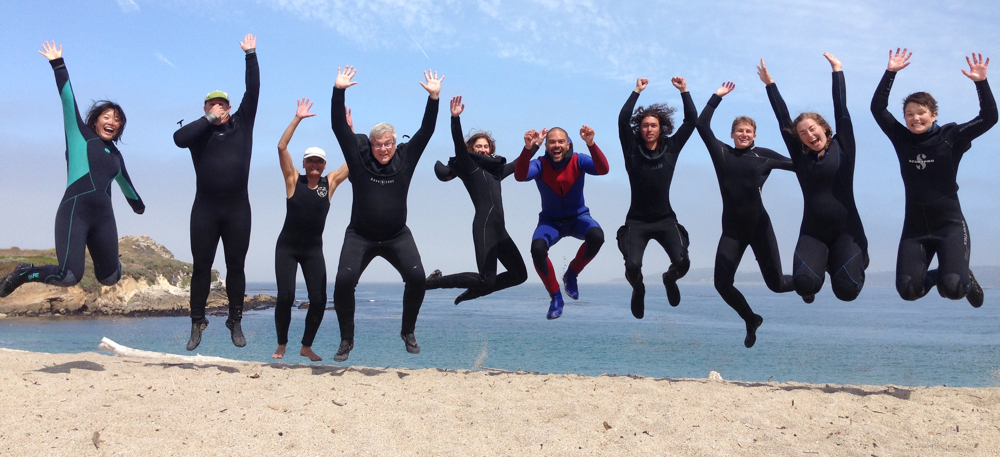

```{r setup, include=FALSE}
knitr::opts_chunk$set(echo = TRUE)

# Set the web address where R will look for files from this repository
# Do not change this address
repo_url <- "https://raw.githubusercontent.com/elahi/github.io/master/"
```

I am an advanced lecturer at Stanford University's Hopkins Marine Station, where I teach courses in marine ecology, invertebrate zoology, and statistics. A bit more info on my upcoming courses can be found [here](https://elahi.github.io/teaching.html). These courses are taught in-person at Hopkins Marine Station and feature outdoor learning, scientific illustration, and telling stories with data. 

Here's my [**CV**](/cv/Elahi_CV_long_241012.pdf).

As a lecturer, I do not take graduate students. Please have a look at the list of [professors at Hopkins](https://hopkinsmarinestation.stanford.edu/people/faculty) for PhD opportunities.



\

### Contact

elahi at stanford dot edu

