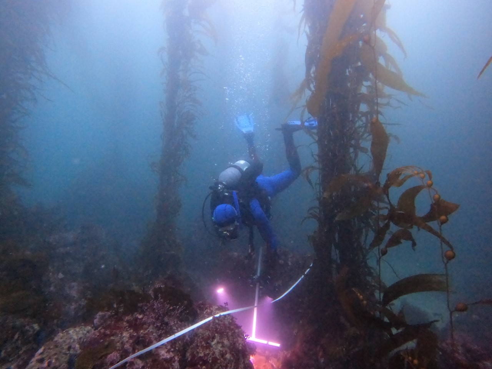

```{r include = FALSE}
# Define the directory where images generated by knit will be saved
knitr::opts_chunk$set(fig.path = "images/research/")

# Set the web address where R will look for files from this repository
# Do not change this address
repo_url <- "https://raw.githubusercontent.com/elahi/github.io/master/"
```

My current projects are focused on the natural history and ecology of our local kelp forests and rocky shores, in collaboration with the students in my classes and undergraduate research interns. Below are some links to the public repositories with data, images, and videos from recent efforts:

-   [Rocky intertidal photographic surveys](https://purl.stanford.edu/kv041ng6595)

-   [Kelp forest video surveys](https://purl.stanford.edu/wp446bg1851)

-   [Time series data from the HMS kelp forest ecology course](https://purl.stanford.edu/pz371sk3632)

### Selected publications

If you would like a pdf of any of my publications, please contact me - elahi at stanford dot edu.

**Elahi, R.**, Micheli, F., and J.M. Watanabe. Submitted. Passing the quadrat: inferring biodiversity change over time and across investigators. In review at PeerJ; [Biorxiv preprint](https://biorxiv.org/cgi/content/short/2024.11.05.622130v1)

- [Data and code](https://purl.stanford.edu/fd733kb4905) 

Gissi, E., Goodman, M.C., **Elahi, R.**, McDevitt-Irwin, J.M., Arnoldi, N.S., Arafeh-Dalmau, N., Knight, C.J., Olguín-Jacobson, C., Palmisciano, M., Tillman, C.M. and G.A. De Leo. 2024. *Sex-specific variation in species interactions matters in ecological communities.* [Trends in Ecology and Evolution](https://www.cell.com/trends/ecology-evolution/abstract/S0169-5347(24)00171-X).


**Elahi, R.**, Edmunds, P.J., Gates, R.D., Kuffner, I.B., Barnes, B.B., Chollett, I., Courtney, T.A., Guest, J.R., Lenz, E.A., Toth, L.T., Viehman, T.S., and I.D. Williams. 2022. *Scale dependence of coral reef oases and their environmental correlates.* [Ecological Applications 32: e2651](https://esajournals.onlinelibrary.wiley.com/doi/full/10.1002/eap.2651)

-   [Data and code](https://purl.stanford.edu/zb133qp4049)

**Elahi, R.**, Miller, L.P., and S.Y. Litvin. 2020. *Historical comparisons of body size are sensitive to data availability and ecological context.* [Ecology 101:e03101](https://doi.org/10.1002/ecy.3101)

-   [Data and code](https://purl.stanford.edu/bs528mw1630)

Micheli, F., Carlton, J., Pearse, J., Selgrath, J., **Elahi, R.**, Watanabe, J., Mach, M.E., McDevitt-Irwin, J., Pearse, V., Burnett, N., and C. Baxter. 2020. *Field stations as sentinels of change.* [Frontiers in Ecology and the Environment 18:320-322](https://doi.org/10.1002/fee.2231)

**Elahi, R.**, Ferretti, F., Bastari, A., Cerrano, C., Colloca, F., Kowalik, J., Ruckelshaus, M., Struck, A. and F. Micheli. 2018. *Leveraging vessel traffic data and a temporary fishing closure to inform marine management.* [Frontiers in Ecology and Environment 16:440-446](https://doi.org/10.1002/fee.1936)

-   [Data and code](https://purl.stanford.edu/hj240pg7057)

Guest, J.R., Edmunds, P.J., Gates, R.D., Kuffner, I.B., Andersonn, A.J., Barnes, B.B., Chollett, I., Courtney, T.A., **Elahi, R.**, Gross, K., Lenz, E.A., Mitarai, S., Mumby, P.J., Nelson, H.R., Parker, B.A., Putnam, H.M., Rogers, C.S. and L.T. Toth. 2018. *A framework for identifying and characterising coral reef "oases" against a backdrop of degradation.* [Journal of Applied Ecology 55: 2865-2875](https://doi.org/10.1111/1365-2664.13179)

-   [Simulations of coral cover (e.g., Figure 1)](https://github.com/elahi/coral_sims)

O'Leary, J., Micheli, F., Airoldi L., Boch C., De Leo, G., **Elahi, R.**, Ferretti, F., Graham, N.A.J., Litvin, S.Y., Low, N.H., Lummis, S., Nickols, K.J. and J. Wong. 2017. *Resilience of marine ecosystems to climatic disturbances.* [BioScience 67: 208-220](https://doi.org/10.1093/biosci/biw161)

-   [Data and code for Figures 3 and 4](https://github.com/elahi/bright_spots)

**Elahi, R.**, Sebens, K.P. and G.A. De Leo. 2016. *Ocean warming and the demography of declines in coral body size.* [Marine Ecology Progress Series 560: 147-158](https://doi.org/10.3354/meps11931)

**Elahi, R.**, O'Connor, M.I., Byrnes, J.E.K., Dunic, J., Eriksson, B.K., Hensel, M.J.S. and P.J. Kearns. 2015. *Recent trends in local-scale marine biodiversity reflect community structure and human impacts.* [Current Biology 25:1938-1943](https://doi.org/10.1016/j.cub.2015.05.030)

-   [Data and code](https://github.com/elahi/marBiodivChange)

**Elahi, R.**, Birkeland, C., Sebens, K.P, Turner, K.R. and T.R. Dwyer. 2013. *Limited change in the diversity and structure of subtidal communites over four decades.* [Marine Biology 160:3209-3219](https://doi.org/10.1007/s00227-013-2308-3)

-   [Data from dissertation](https://github.com/elahi/phd_elahi)

**Elahi, R**. and K.P. Sebens. 2012. *Consumers mediate natural variation between prey richness and resource use in a benthic marine community.* [Marine Ecology Progress Series 452:131-143](https://doi.org/10.3354/meps09603)

Edmunds, P.J. and **R. Elahi.** 2007. *The demographics of a 15-year decline in cover of the Caribbean reef coral Montastraea annularis.* [Ecological Monographs 77:3-18](https://doi.org/10.1890/05-1081)

**Elahi, R.** and P.J. Edmunds. 2007. *Consequences of fission in the coral Siderastrea siderea: growth rates of small colonies and clonal input to population structure.* [Coral Reefs 26:271-276](https://doi.org/10.1007/s00338-006-0190-x)



<!-- [Manuscript draft](/docs/hewatt_ms_240923.pdf). -->
